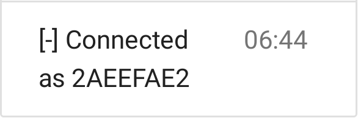
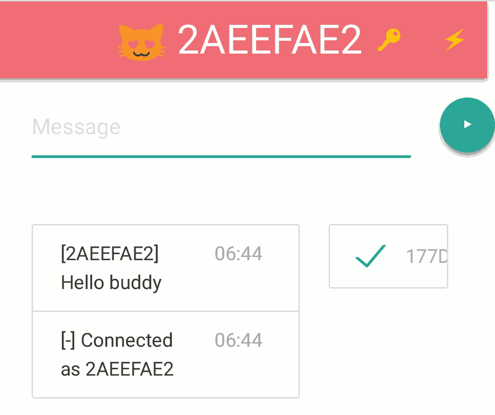

* A [WebSocket](https://developer.mozilla.org/en-US/docs/Web/API/Websockets_API) chat
* End-to-end encrypted using [SubtleCrypto](https://developer.mozilla.org/en-US/docs/Web/API/SubtleCrypto)
* Demo on [Heroku](https://subtle-crypto-websocket-chat.herokuapp.com/)

## Get started

* Hit the _deploy on heroku_ button below
* Go to the url page, for instance [this demo server](https://subtle-crypto-websocket-chat.herokuapp.com/)

## Connection steps

* When landing you'll see a nice logo   
* The server is up, you're WebSocket connected   
* You browser generated a **private** crypto key pair - stored, next time it will be faster   
* A first local message confirms you're connected, with you buddy *hash*   
* Your contacts do the same, they appear on the right. Click to approve them   
* Now chat, end-to-end encrypted 

## Deploy

